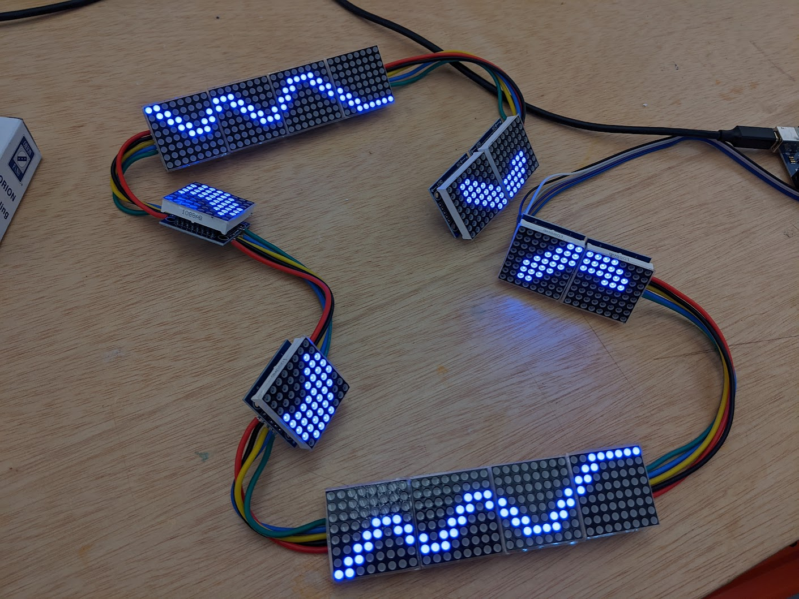

Code for my protogen named Nytrix. This repo has all the garbage code I wrote for both V1 and V2.

Is this code good? Absolutely not. Does it work? That is debatable.

IDK why you would, but if you use this code, customize it a little. I don't wanna run into another Nytrix 😳

If you wanna add anything, feel free to submit a PR.

# V1

V1 had a really simple circuit. I used a chain of 8x8 MAX7219 lights connected to an Arduino Uno. Specifically I used the blue variation of the LEDs. You can find the red ones all over the place, the blue ones are a bit harder to find.



<video src="https://github.com/gmongaras/Protogen_Code_Public/blob/main/images/V1_vid.mp4"></video>


# V2

The V2 model is upgraded in general. I used the following main components:
- Kaiborg base
- Adafruit Matrix Portal S3
- 64x32 RGB LED Matrix - 2.5mm pitch
- NeoPixel Ring - 24 x 5050 RGBW LEDs w/ Integrated Drivers - Cool White - ~6000K
- Adafruit VCNL4040 Proximity and Lux Sensor - STEMMA QT

I don't have a wiring diagram as I build it in the helmet piece at a time. I kept adding stuff lol. Anyway, the following are the features:

By default the lights are rotating RGB for both the side peices and the face pieces. You can throw a different set of frames on there to change the face.

<video src="https://github.com/gmongaras/Protogen_Code_Public/blob/main/images/V2_base.mp4"></video>

A boop sensor exists

<video src="https://github.com/gmongaras/Protogen_Code_Public/blob/main/images/V2_boop.mp4"></video>

You can change things with bluetooth

<video src="https://github.com/gmongaras/Protogen_Code_Public/blob/main/images/V2_demo.mp4"></video>

It also looks cool in the dark.

<video src="https://github.com/gmongaras/Protogen_Code_Public/blob/main/images/V2_night.mp4"></video>


There are other features I didn't feel like comitting to as they were not worth the trouble. For example, you can put gifs on there, it's just really annoying and limitied due to the limted on-bard RAM.

# V3

No idea how long this is going to take >w<

```
 ⠀⢸⠂⠀⠀⠀⠘⣧⠀⠀⣟⠛⠲⢤⡀⠀⠀⣰⠏⠀⠀⠀⠀⠀⢹⡀
 ⠀⡿⠀⠀⠀⠀⠀⠈⢷⡀⢻⡀⠀⠀⠙⢦⣰⠏⠀⠀⠀⠀⠀⠀⢸⠀
 ⠀⡇⠀⠀⠀⠀⠀⠀⢀⣻⠞⠛⠀⠀⠀⠀⠻⠀⠀⠀⠀⠀⠀⠀⢸⠀
 ⠀⡇⠀⠀⠀⠀⠀⠀⠛⠓⠒⠓⠓⠀⠀⠀⠀⠀⠀⠀⠀⠀⠀⠀⢸⠀
 ⠀⡇⠀⠀⠀⠀⠀⠀⠀⠀⠀⠀⠀⠀⠀⠀⠀⠀⠀⠀⠀⠀⠀⠀⣸⠀
 ⠀⢿⠀⠀⠀⠀⠀⠀⠀⠀⠀⠀⠀⠀⠀⠀⢀⣀⣀⣀⣀⠀⠀⢀⡟⠀
 ⠀⠘⣇⠀⠘⣿⠋⢹⠛⣿⡇⠀⠀⠀⠀⣿⣿⡇⠀⢳⠉⠀⣠⡾⠁⠀
 ⣦⣤⣽⣆⢀⡇⠀⢸⡇⣾⡇⠀⠀⠀⠀⣿⣿⡷⠀⢸⡇⠐⠛⠛⣿⠀
 ⠹⣦⠀⠀⠸⡇⠀⠸⣿⡿⠁⢀⡀⠀⠀⠿⠿⠃⠀⢸⠇⠀⢀⡾⠁⠀
 ⠀⠈⡿⢠⢶⣡⡄⠀⠀⠀⠀⠉⠁⠀⠀⠀⠀⠀⣴⣧⠆⠀⢻⡄⠀⠀
 ⠀⢸⠃⠀⠘⠉⠀⠀⠀⠠⣄⡴⠲⠶⠴⠃⠀⠀⠀⠉⡀⠀⠀⢻⡄⠀
 ⠀⠘⠒⠒⠻⢦⣄⡀⠀⠀⠀⠀⠀⠀⠀⠀⢀⣀⣤⠞⠛⠒⠛⠋⠁⠀
 ⠀⠀⠀⠀⠀⠀⠸⣟⠓⠒⠂⠀⠀⠀⠀⠀⠈⢷⡀⠀⠀⠀⠀⠀⠀⠀
 ⠀⠀⠀⠀⠀⠀⠀⠙⣦⠀⠀⠀⠀⠀⠀⠀⠀⠈⢷⠀⠀⠀⠀⠀⠀⠀
 ⠀⠀⠀⠀⠀⠀⠀⣼⣃⡀⠀⠀⠀⠀⠀⠀⠀⠀⠘⣆⠀⠀⠀⠀⠀⠀
 ⠀⠀⠀⠀⠀⠀⠀⠉⣹⠃⠀⠀⠀⠀⠀⠀⠀⠀⠀⢻⠀⠀⠀⠀⠀⠀
 ⠀⠀⠀⠀⠀⠀⠀⠀⡿⠀⠀⠀⠀⠀⠀⠀⠀⠀⠀⢸⡆⠀⠀⠀⠀⠀
```